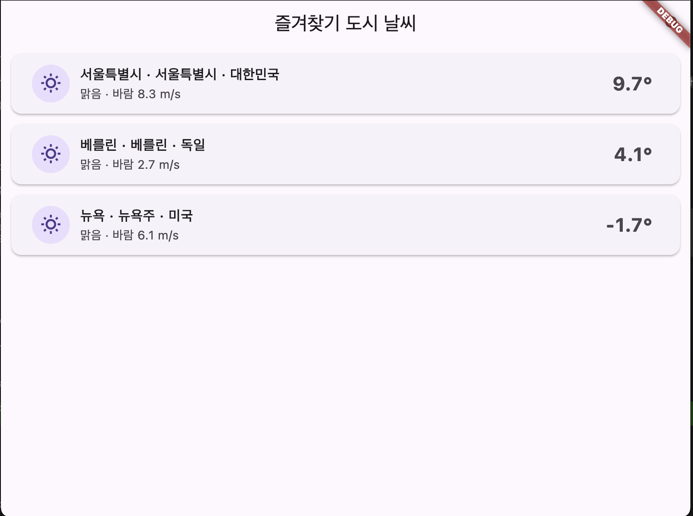
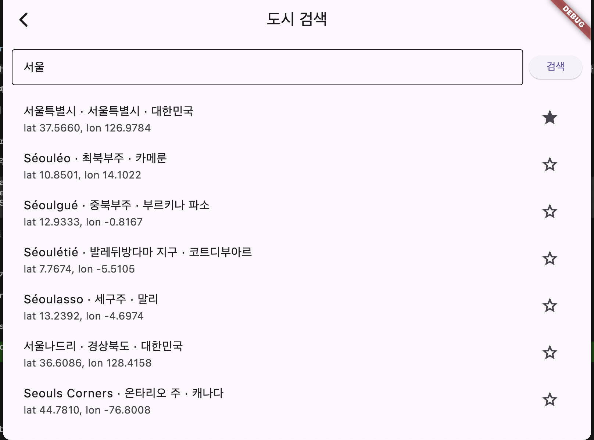

# Open-Meteo Weather

[Open-Meteo](https://open-meteo.com/) 무료 API를 활용한 Flutter 날씨 앱입니다.
Flutter 학습 과정에서 Clean Architecture와 상태관리 패턴을 직접 적용해보기 위해 제작했습니다.

---

## 스크린샷

| 홈 화면 | 도시 검색 |
|---------|-----------|
|  |  |

---

## 주요 기능

- 도시 검색 (Open-Meteo Geocoding API)
- 즐겨찾기 도시 등록 / 삭제
- 즐겨찾기 도시 현재 날씨 목록
- 도시별 상세 날씨 (현재 + 7일 예보)
- 날씨 데이터 로컬 캐싱 (TTL 10분, pull-to-refresh 지원)

---

## 기술 스택

| 분류 | 사용 기술 |
|------|-----------|
| UI | Flutter 3, Material 3 |
| 상태관리 | Provider (`ChangeNotifier`) |
| 네트워크 | Dio |
| 로컬 저장소 | Hive (즐겨찾기 영구 저장 + 캐시) |
| 아키텍처 | Clean Architecture (Data / Domain / Presentation) |
| 에러 처리 | `sealed class Result<T>` (OK / Err) |

---

## 아키텍처

```
lib/
├── core/
│   ├── app_error.dart        # 에러 타입 정의
│   ├── result.dart           # sealed class Result<T>
│   ├── dio_client.dart       # Dio 싱글턴
│   └── cache/
│       ├── hive_cache.dart   # TTL 기반 캐시
│       └── cache_entry.dart
├── data/
│   ├── models/               # Weather, City, WeatherDetail
│   └── sources/
│       └── open_meteo_api.dart
├── domain/
│   └── repositories/
│       ├── weather_repository.dart
│       └── city_repository.dart
└── presentation/
    ├── providers/            # WeatherListProvider, WeatherDetailProvider, CityProvider
    ├── screens/              # HomeScreen, CitySearchScreen, WeatherDetailScreen
    └── ui/
        └── weather_code_mapper.dart
```

---

## 설계 포인트

- **`Result<T>` 패턴**: `sealed class`를 활용해 성공/실패를 타입 수준에서 강제. `switch`로 완전한 분기 처리 가능.
- **캐시 레이어 분리**: `HiveCache`를 Repository에 주입해, API 호출 전 TTL 유효성 검사 후 캐시 우선 반환.
- **의존성 주입**: `MultiProvider`에서 Repository를 생성해 Provider에 주입. 테스트 시 교체 용이.

---

## 실행 방법

```bash
flutter pub get
flutter run
```

> API 키 불필요 — Open-Meteo는 완전 무료 오픈 API입니다.

---

## 사용 API

- [Open-Meteo Weather API](https://open-meteo.com/en/docs) — 현재 날씨, 시간별/일별 예보
- [Open-Meteo Geocoding API](https://open-meteo.com/en/docs/geocoding-api) — 도시 검색
